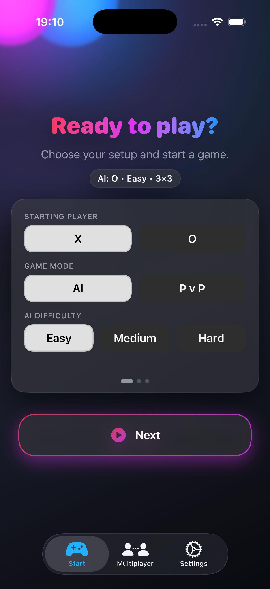
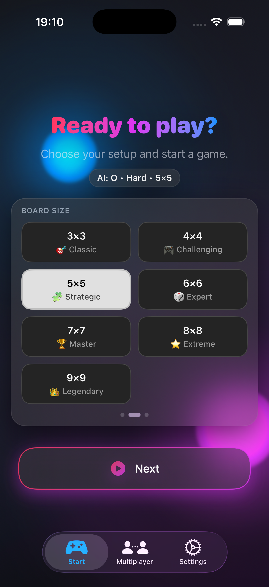
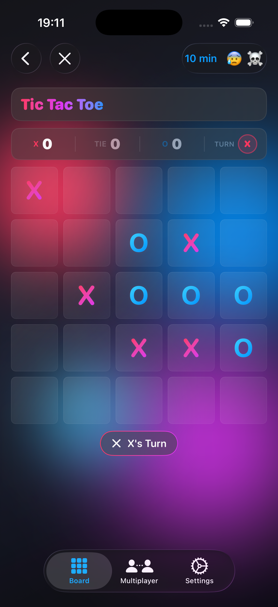
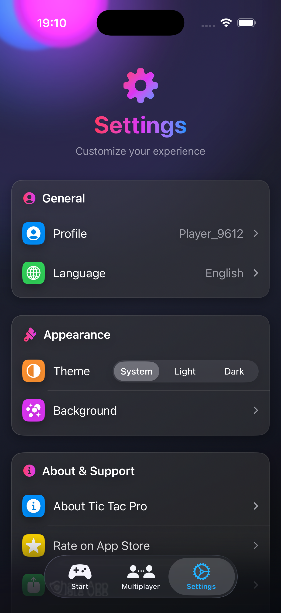

# 🎮 Tic Tac Pro

Tic Tac Pro is a modern take on the classic Tic-Tac-Toe game, designed with a clean UI, rich customization options, AI opponents, and multiplayer support. Built with Swift and SwiftUI, the app focuses on performance, accessibility, and scalability.

---

## 📸 Screenshots

  
  
  
  

---

## ✨ Features

- 🧠 **AI Opponents** — multiple difficulty levels
- 🌍 **Online Multiplayer** — play with friends using room codes
- 👥 **Local Multiplayer** — play on the same device
- 🎨 **Modern UI/UX** — clean, intuitive, and responsive design
- 🌗 **Theme Support** — Light, Dark, and System
- 🧩 **Custom Board Sizes** — flexible grid configurations
- ⏱ **Time Limits** — optional timed gameplay
- 🌐 **Full Localization** (10+ languages)
  - English (Base)
  - Arabic (RTL supported)
  - French
  - German
  - Russian
  - and more

> **Note:** AI-generated messages are not localized

---

## 📱 Platform

- iOS
- Built with **Swift** and **SwiftUI**
- Uses `Localizable.xcstrings` for localization

---

## 🎮 Game Modes

| Mode | Description |
|------|-------------|
| 👤 Single Player | Play against AI with multiple difficulty levels |
| 👥 Local Multiplayer | Play with a friend on the same device |
| 🌍 Online Multiplayer | Invite friends via room code |

---

## 🌐 Localization

The app uses `Localizable.xcstrings` and supports:

- Right-to-Left (RTL) layouts (Arabic)
- Dynamic text sizing
- Locale-aware formatting
- Easy scalability for adding new languages

---

## 🛠 Technical Overview

- **SwiftUI** — declarative UI framework
- **State-driven architecture** — reactive and predictable state management
- **Modular UI components** — reusable and maintainable
- **`.xcstrings`-based localization** — modern string catalog format
- **Clean and maintainable codebase**
